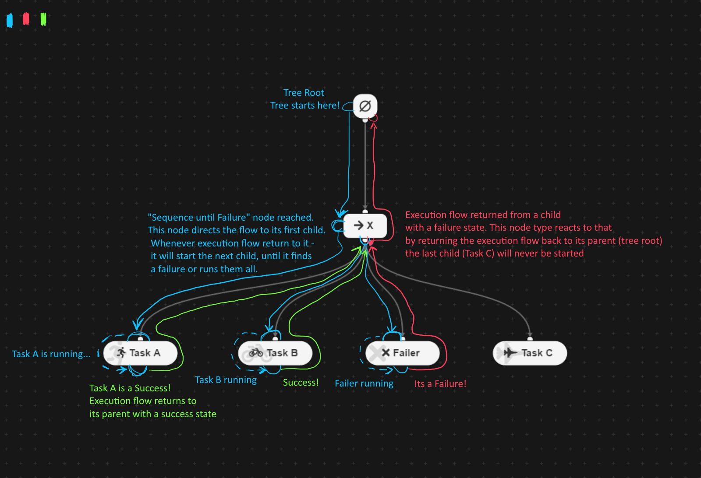
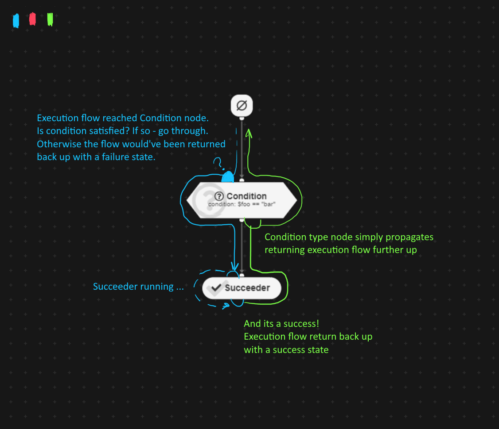
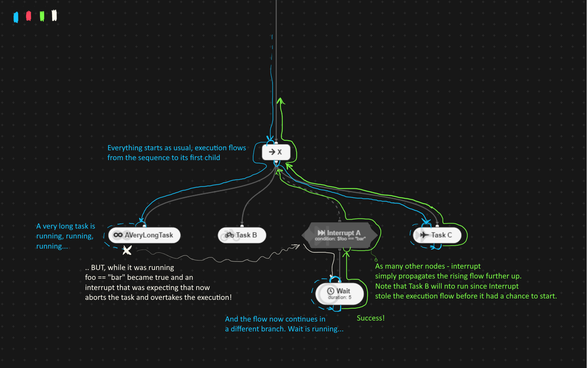
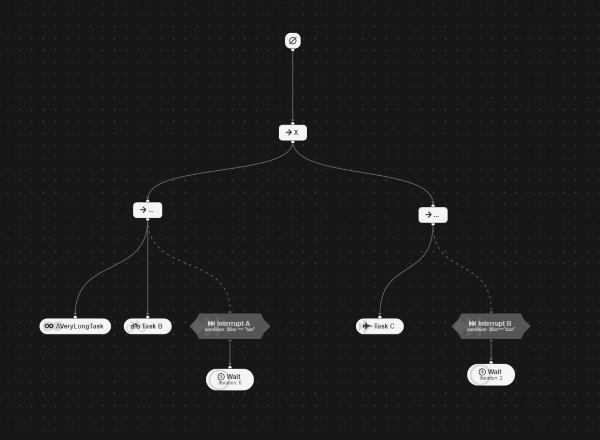

# BehaviourTree.lua 2e
## 2nd edition. Not better. Different.

A Lua implementation of Behavior Trees based on [BehaviorTree.lua](https://github.com/tanema/behaviourtree.lua).
Can be used for video game AI, robotics and whatever else one can imagine.
Runs faster (source: a hunch and 0 benchmarking), introduces Interrupt nodes and parallel nodes that can execute branches simultaneously.
Now fully supports a visual editor: [Behavior3+ editor](https://github.com/MaxYari/behavior3editorplus)

## Installation
Just copy the lib folder into your project folder, rename it (example: 'behaviourtree')

- Lua: `local BehaviourTree = require('behaviourtree/behaviour_tree')`
- Love2D: `local BehaviourTree = require('behaviourtree') --uses init.lua file`

## How to use
== This part of documentation is under heavy construction ==

The intended way of using this library is in tandem with [Behavior3+ editor](https://github.com/MaxYari/behavior3editorplus). 
1. Develop your behaviors in the editor
2. Export your project
3. Load the project into BehaviourTree.lua 2e, you will need a [json parser](https://github.com/rxi/json.lua).
4. `:run()` your trees every frame (or wherever you like)

``` lua
-- OPTIONAL! If your lua environment doesnt support functions specified by default in these fields - you need to provide a replacement
_BehaviourTreeImports = {
    clock = core.getRealTime -- Default: os.clock
    loadCodeHere = youStringToLuaCodeParser -- Default: load or loadstring (both will be checked)
    loadCodeInScope = yourScopedStringToLuaCodeParser, -- Default: internal wrapper around loadCodeHere. 
                                                       -- Similar to loadCodeHere but accepts (string,scope) where scope is an object in which
                                                       -- scope code will be executed. Please provide loadCodeHere OR loadCodeInScope, no need to supply both.
}
---------------------------------------------------------------------------------------------------------------------------------------

local BT = require('behaviourtree/behaviour_tree')

-- Read the behaviour tree JSON file exported from the editor---------------
local file = vfs.open("scripts/MaxYari/experiments/OpenMW AI.b3")
if not file then error("Failed opening behaviour tree file.") end
local projectJsonTable = json.decode(file:read("*a")) -- Decode it
file:close() -- And close it
----------------------------------------------------------------------------

-- Initialise behaviour trees ----------------------------------------------
local bTrees = BT.LoadBehavior3Project(projectJsonTable, state)
-- bTrees.MyTree:setDebugLevel(1) -- Set debug level for a specific tree, MyTree is the name of your tree from the editor.
-- Ready to use! -----------------------------------------------------------

```

Then whenever you want to run a single tick of your behaviour tree (usually done once per frame/execution loop) - simply use


``` lua
  bTrees.MyTree1:run()
  bTrees.MyTree2:run()
  --- e.t.c for all of your trees
```

## But what IS a behaviour tree?

Behaviour trees are a general concept of programming behaviors. Those can be behaviors of virtual actors (game NPCs), robots or bigger systems. Compared to a series of if/else statements behaviour trees allow to orginise different patterns of behaviours in a much succinct and readable fashion, especially when visual editor is used. Behaviour trees are used in many games and engines to orginise AI behaviours, make them reactively respond to player actions in fairly complex ways. Behaviour trees is not the only way of programming artificial agents, it is one of the widely used, and it does work great when it fits the purpose.
Since it's a widespread and general concept - you can easily find a throughout explanation of how behaviour trees work online.
For example [here is Unreal Engine BT tutorial](https://www.youtube.com/watch?v=iY1jnFvHgbE) , it will not map 1 to 1 to this library, but it will give you a general overview of how behaviour trees function.

### Terminology:
- *Frame/Tick* - a single `:run()` of a behaviour tree. Many things can happen during a single tick, from simply running a currenly active node to the active node finishing and the execution flow traveling many nodes through the tree until it finds the next Task.
- *Task* - a terminal node at the end of any branch, its a node that most often actually does the work and executes for longer than a single frame/tick. Task doesn't NEED to run for more than a frame, in fact it can return success/fail as soon as it starts allowing the execution flow to continue traveling withing the same tree tick until a new Task will be found.
- *Execution flow* - an imaginary flow that determines which node will be started and run next. Execution flow almost never jumps around, it flows from a parent to a child and back, it brings with it success or fail statuses, its a life-blood of a behaviour tree.
- *Success/Failure state* - Nodes always eventually return the execution flow back to their parent, while doing so they also return their completion state with it so the parent will know if the child finished with a success or a failure and will act accordingly. Note that not only Task nodes return a state - every node does, some simply propagate their child Task states further, some modify it, some base their further actions on the received state.

## Show don't tell
Below are image-overviews of few important node types, use it to test your understanding of behaviour tree execution flow.
Descriptions for every node type are available directly withing the editor ui, simply hover over a node name in your project's node list.

### Composites - Sequence node
Belongs to the only group of nodes (Composites aka Branch nodes) that can have more than a single child node. These nodes usually used to execute sequences of tasks, multiple tasks at the same time (Parallel node), or to pick one of the child tasks (Run Random node). 



### Decorators - Condition node
Belongs to a group of nodes (Decorators) that require a single child node to be attached to them. Decorators act as a checkpoint affecting the execution flow on the way towards the child or out of it. They can decide to bounce the execution flow back (with a success or a failure state) and not let it through to its child, or to alter a state returned from a child.



### Interrupts - Interrupt node
Interrupts are fairly complex, but add an unprecedented flexibility to the tree. They can only be used as direct children of a Composite node and they only work within the scope of their composite parent, meaning their ability of interrupt can only affect branches neighbouring them through their own parent - direct siblings if you will. 
Now, what's so special about them? Usually only the currently running node is executed each tick of the tree, but Interrupts are exceptions. Every tick of the tree, no matter what is being executed - a registered interrupt will run a "should I start running?", if that check returns true - it will unscrupulously abort currently running branch and "teleport" the execution flow to itself. From that moment it will largely act as a Decorator - the execution flow will continue to its child and eventually come back to the Interrupt. Note that the execution flow will never be teleported back to where it was aborted, when the execution flow reaches Interrupt from its child - it will continue up to Interrupts's parent as if nothing ever happened.
Some Interrupts can never be started directly by their parent and only start when interrupt condition is triggered, other interrupts don't even interrupt neighbouring branches at all (Continuous Condition node), but rather use Interrupt powers to abort own children when condition is not favourable anymore.



*Note*: Interrupts are local to their parent, they can not interrupt branches outside of their Composite parent!
In the image below `AVeryLongTask` can be interrupted by the `Interrupt A`, but not `Interrupt B`. Similarly - `Task C` can only be interrupted by the `Interrupt B`, but not `Interrupt A`.




## Original BehaviourTree.lua how to use. 
### I.e. building trees manually.

I'll be frank, API was heavily altered and this part of the documentation was not updated. The current intended way to use this library is to use it in tandem with
[Behavior3+ editor](https://github.com/MaxYari/behavior3editorplus) (see instructions above). Nevertheless, probably most of the code below will still work, if you'll be brave enough to try building those trees manually - let me know how it went.

### Creating a simple task

A task is a simple `Node` (to be precise a leafnode), which takes care of all the dirty work in it's `run` method, which calls `success()`, `fail()` or `running()` in the end.

``` lua
local mytask = BehaviourTree.Task:new({
  -- (optional) this function is called directly before the run method
  -- is called. It allows you to setup things before starting to run
  -- Beware: if task is resumed after calling running(), start is not called.
  start = function(task, obj)
    obj.isStarted = true
  end,

  -- (optional) this function is called directly after the run method
  -- is completed with either success() or fail(). It allows you to clean up
  -- things, after you run the task.
  finish = function(task, obj)
    obj.isStarted = false
  end,

  -- This is the meat of your task. The run method does everything you want it to do.
  -- Finish it with one of these method calls:
  -- success() - The task did run successfully
  -- fail()    - The task did fail
  -- running() - The task is still running and will be called directly from parent node
  run = function(task, obj)
    task:success()
  end
});

--you can also declare a task like this
local myothertask = BehaviourTree.Task:new()
function myothertask:start(obj)
  obj.isStarted = true
end
function myothertask:finish(obj)
  obj.isStarted = false
end
function myothertask:run(obj)
  self:success()
end
--however the other syntax better lends itself to building an inline table
```

The methods:

* `start`  - Called before run is called. But not if task is resuming after ending with running().
* `finish` - Called after run is called. But not if task finished with running().
* `run`    - Contains the main things you want the task is doing.

The interesting part:

* the argument for all this methods is the object you pass in into the instance of `BehaviourTree` with the `setObject` method. This could be the object you want the behavior tree to control.

### Creating a sequence

A `Sequence` will call every one of it's subnodes one after each other until one node calls `fail()` or all nodes were called. If one node calls `fail()` the `Sequence` will call `fail()` too, else it will call `success()`.

``` lua
local mysequence = BehaviourTree.Sequence:new({
  nodes = {
    -- here comes in a list of nodes (Tasks, Sequences or Priorities)
    -- as objects or as registered strings
  }
})
```

### Creating a priority selector

A `Priority` calls every node in it's list until one node calls `success()`, then itself calls success internally. If none subnode calls `success()` the priority selector itself calls `fail()`.

``` lua
local myselector = BehaviourTree.Priority:new({
  nodes = {
    -- here comes in a list of nodes (Tasks, Sequences or Priorities)
    -- as objects or as registered strings
  }
})
```

### Creating a random selector

A `Random` selector calls randomly one node in it's list, if it returns running, it will be called again on next run.

``` lua
local myselector = BehaviourTree.Random:new({
  nodes = {
    -- here comes in a list of nodes (Tasks, Sequences or Priorities)
    -- as objects or as registered strings
  }
})
```

### Creating a behavior tree

Creating a behavior tree is fairly simple. Just instantiate the `BehaviourTree` class and put in a `Node` (or more probably a `BranchingNode` or `Priority`, like a `Sequence` or `Priority`) in the `tree` parameter.

``` lua
local mytree = BehaviourTree:new({
  tree = 'a selector' -- the value of tree can be either string (which is the registered name of a node), or any node
})
```

### Run through the behavior tree

Before you let the tree do it's work you can add an object to the tree. This object will be passed into every `start()`, `finish()` and `run()` method as first argument. You can use it, to let the Behavior tree know, on which object (e.g. artificial player) it is running. After this just call `run()` whenever you have time for some AI calculations in your game loop.

``` lua
mytree:setObject(someBot);
-- do this in a loop:
mytree:run();
```

### Using a lookup table for your tasks

If you need the same nodes multiple times in a tree (or even in different trees), there is an easy method to register this nodes, so you can simply reference it by given name.

``` lua
-- register a tree node using the registry
BehaviourTree.register('testtask', mytask)
-- or register anything automatically by giving it a name
BehaviourTree.Task:new({
  name = 'registered task'
  -- run impl.
})

```

Now you can simply use it by name

### Now putting it all together

And now an example of how all could work together.

``` lua
BehaviourTree.Task:new({
  name = 'bark',
  run = function(task, dog)
    dog:bark()
    task:success()
  end
})

local btree = BehaviourTree:new({
  tree = BehaviourTree.Sequence:new({
    nodes = {
      'bark',
      BehaviourTree.Task:new({
        run = function(task, dog)
          dog:randomlyWalk()
          task:success()
        end
      }),
      'bark',
      BehaviourTree.Task:new({
        run = function(task, dog)
          if dog:standBesideATree() then
            dog:liftALeg()
            dog:pee()
            task:success()
          else
            task:fail()
          end
        end
      }),

    }
  })
});

local dog = Dog:new(--[[..]]) -- the nasty details of a dog are omitted

btree:setObject(dog)
for _ = 1, 20 do
  btree:run()
end
```

In this example the following happens: each pass on the for loop (our game loop), the dog barks – we implemented this with a registered node, because we do this twice – then it walks randomly around, then it barks again and then if it find's itself standing beside a tree it pees on the tree.

### Decorators

Instead of a simple `Node` or any `BranchingNode` (like any selector), you can always pass in a `Decorator` instead, which decorates that node. Decorators wrap a node, and either control if they can be used, or do something with their returned state. (Just now) Implemented is the base class (or a transparent) `Decorator` which just does nothing but passing on all calls to the decorated node and passes through all states.

But it is useful as base class for new implementations, like the implemented `InvertDecorator` which flips success and fail states, the `AlwaysSucceedDecorator` which inverts the fail state, and the `AlwaysFailDecorator` which inverts the success state.

``` lua
local mysequence = BehaviourTree.Sequence:new({
  nodes = {
    -- here comes in a list of nodes (Tasks, Sequences or Priorities)
    -- as objects or as registered strings
  }
})
local decoratedSequence = BehaviourTree.InvertDecorator:new({
  node: mysequence
})
```

*Those three decorators are useful, but the most useful decorators are those you build for your project, that do stuff with your objects. Just [check out the code](https://github.com/tanema/behaviourtree.lua/blob/master/node_types/invert_decorator.lua), to see how simple it is, to create your decorator.*
